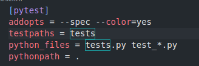
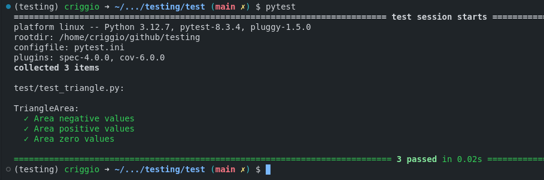

# Testing  

Este proyecto pretende mostrar un ejemplo de cómo configurar un entorno en el que poder realizar códigos y pruebas.  

## Estructura del proyecto  
1. **División del entorno en carpetas**  
   - **`src`**: Contendrá el código principal.  
   - **`test`**: Contendrá todos los archivos `test_*.py` para realizar las pruebas.  

2. **Instalación de herramientas necesarias**  
   Instalaremos las siguientes dependencias utilizando `pip`:  
   - `pytest`  
   - `pytest-spec`  

3. **Configuración de pytest**  
   A la misma altura de las carpetas `src` y `test`, crearemos el archivo de configuración de pytest, llamado `pytest.ini`, con la siguiente configuración:  

   
  
        
   
  

4. **Ejecución de pruebas**  
   Configuraremos las pruebas y las ejecutaremos mediante `pytest` en la terminal, obteniendo el siguiente resultado:  

   
  
        
   
  
